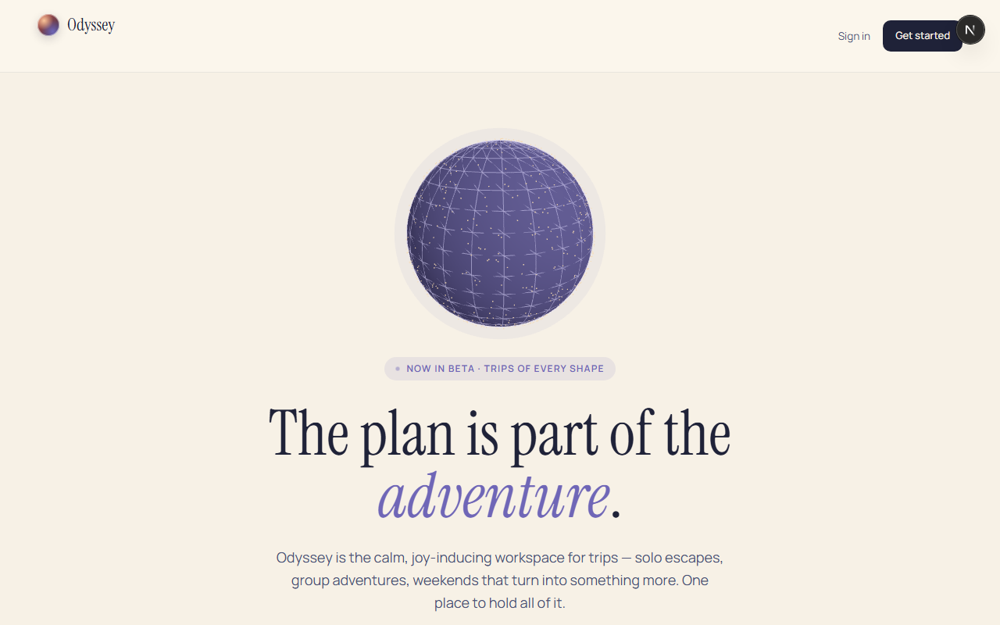

# Odyssey

<p align="center">
  
</p>

**The plan is part of the adventure.**

Odyssey is a collaborative travel itinerary planner — a calm, editorial workspace for solo escapes, group trips, and weekends that turn into something more. Build the day-by-day plan, pin the route on a map, invite your crew, track the budget, and keep notes where you’ll actually find them.

Creative direction: **boarding pass + printed map** — DM Serif Display for display type, DM Sans for body, JetBrains Mono for figures. Soft paper backgrounds, periwinkle accents, and type-colored events (flights coral, hotels gold, meals peach, activities teal). Planning should feel as good as the trip.

---

## What you can do

| Surface | Intent |
|---|---|
| **Dashboard** | All your trips at a glance — live, upcoming, wrapped |
| **Itinerary** | Day-by-day timeline, drag-and-drop, inline notes |
| **Map** | Leaflet pins for itinerary + collections |
| **Schedule** | Availability polls and a best-window heatmap |
| **Budget** | Expenses, trip-level weighted split, settle-up suggestions |
| **Explore / Collections** | Vibe search near the destination; save maybes |
| **Members** | Invite by email; editors plan, viewers follow along |
| **Notes** | Shared trip notes (plain + rich text) |

---

## Stack

| Layer | Choice |
|---|---|
| Framework | Next.js 16 App Router |
| Language | TypeScript (strict) |
| Auth | Clerk |
| Database | PostgreSQL on Supabase |
| ORM | Prisma (via `src/lib/prisma/db.ts` only) |
| Styling | Tailwind CSS v4 + design tokens in `globals.css` |
| Map | Leaflet (dynamic import, `ssr: false`) |
| Rich text | Tiptap |
| DnD | dnd-kit |
| Deploy | Vercel |

---

## Setup

### 1. Install

```bash
git clone <repo>
cd odyssey
npm install
```

### 2. Environment

Create `.env.local` with Clerk keys, Supabase URL/keys, and Prisma URLs:

- `DATABASE_URL` — Supabase **Transaction Pooler** (port `6543`)
- `DIRECT_URL` — Supabase **Direct** connection (port `5432`)
- `NEXT_PUBLIC_APP_URL` — `http://localhost:3000` locally

### 3. Database

This project uses **`prisma db push`** (no migrations directory; Supabase free-tier may pause):

```bash
npx prisma db push
npx prisma generate
```

### 4. Dev server

```bash
npm run dev
```

Open [http://localhost:3000](http://localhost:3000). Landing also lives at `/welcome`.

### Checks

```bash
npm run lint
npm test
npx tsc --noEmit
```

---

## Creative guardrails

- One token system: CSS variables in `src/app/globals.css` (`--peri`, `--teal`, `--coral`, `--paper`, `--ink`, …). No hardcoded hex outside that file.
- No `localStorage` / `sessionStorage`.
- Forms validate with Zod before server actions; membership via `assertTripRole`.
- Keep the editorial, uncluttered UI — progressive disclosure over dense dashboards.

---

## Deploy

Push to GitHub → Vercel. Mirror `.env.local` as project env vars (use production Clerk keys for a real audience). After schema changes, run `npx prisma db push` against production when the Supabase project is awake.

---

## Roadmap

See [`BACKLOG.md`](./BACKLOG.md) for prioritized tickets (including Splitwise-grade expense splits, packing lists, and mobile polish).
